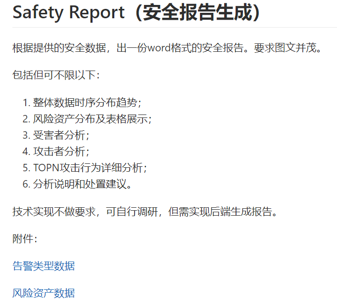
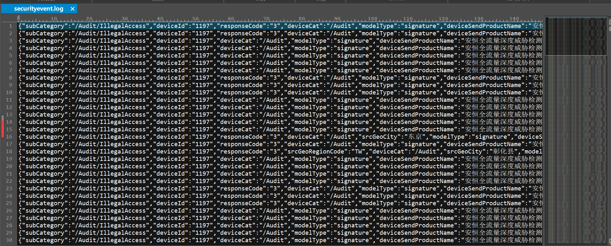
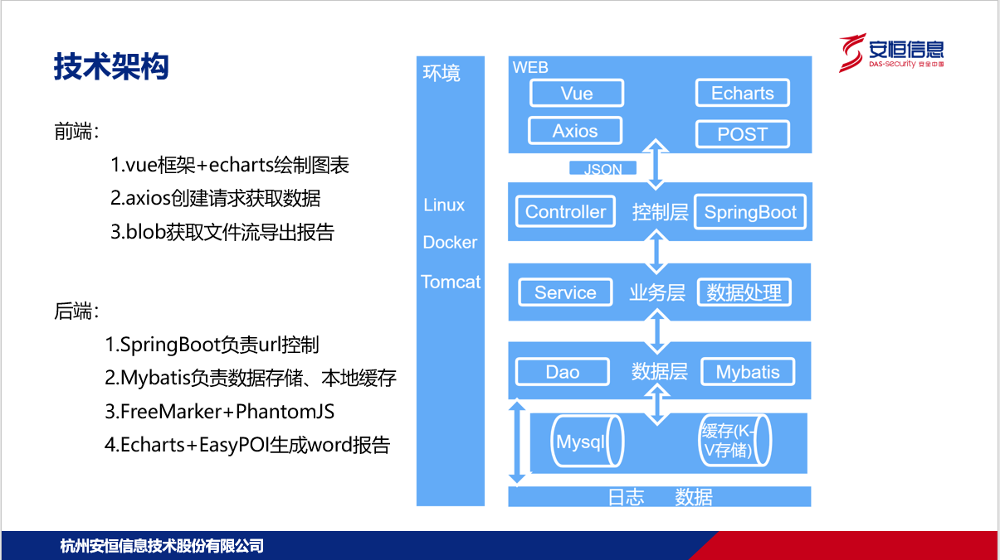
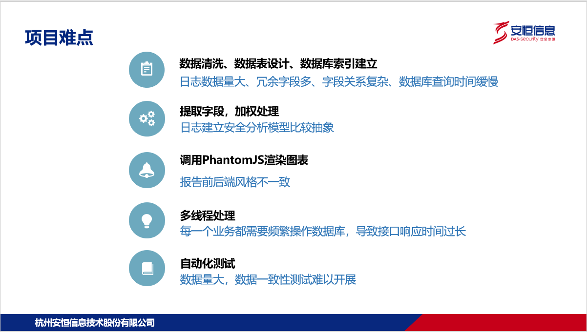
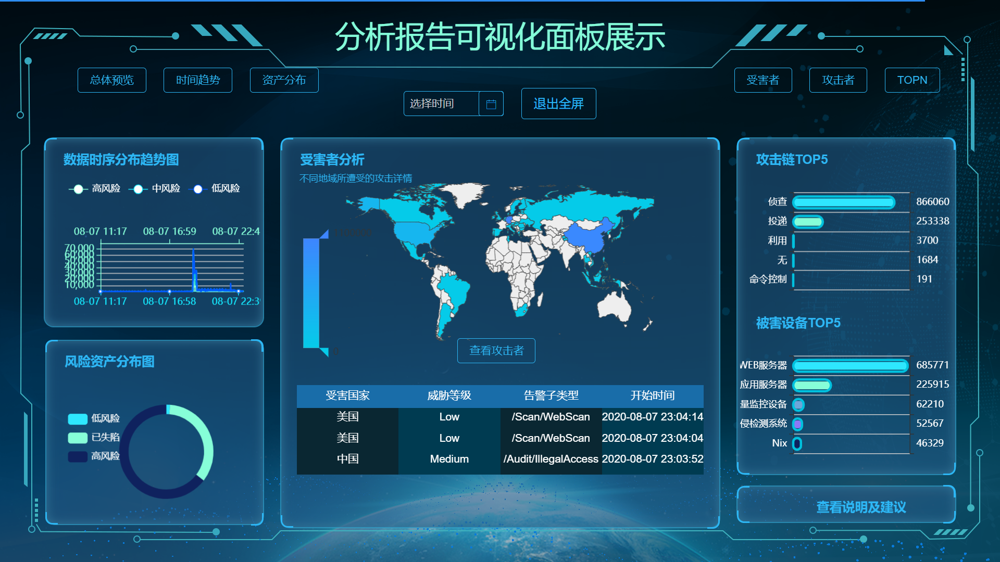
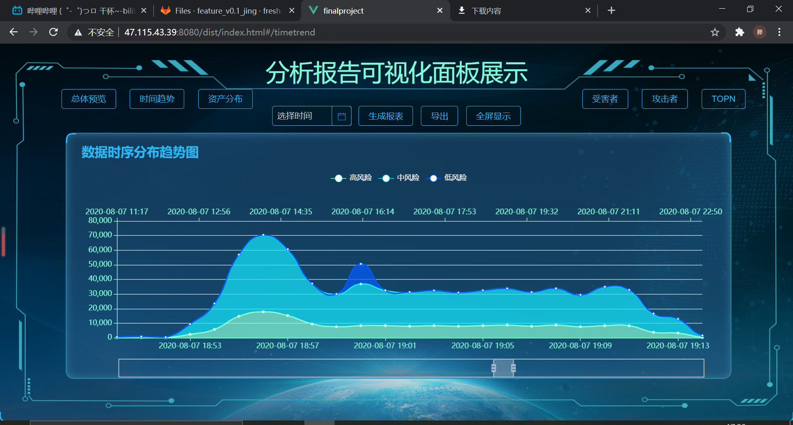
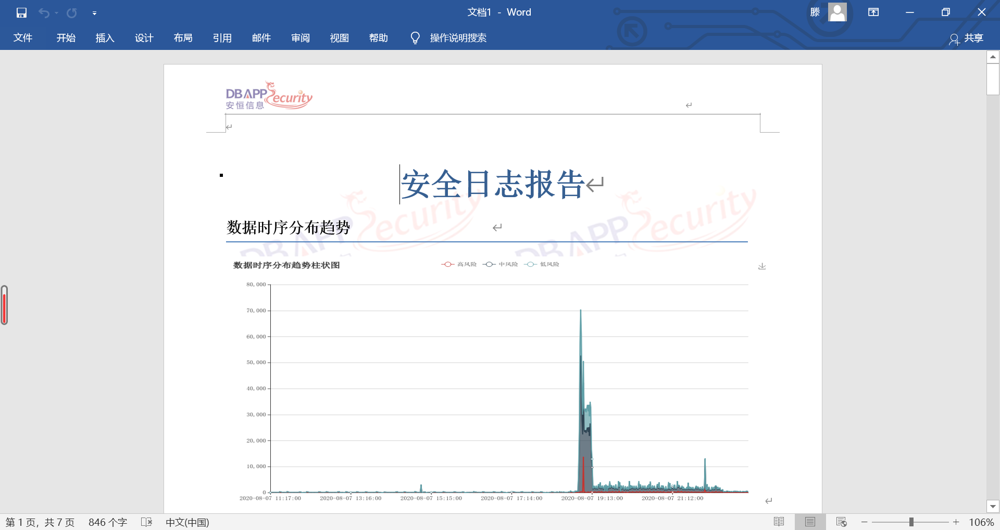
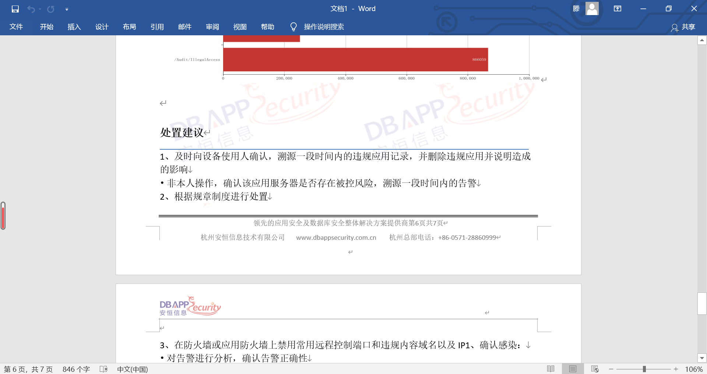

# SafetyReport

> 基于SpringBoot的安全报告生成项目


### 技术点

1. 后端:springBoot、Mybatis、FreeMarker、PhantomJS、EasyPOI
2. 存储:Mysql、Redis
3. 前端:vue、echarts
4. 部署:Dockerfile


### 文件说明

````txt
--AHreport  	   后端项目
--Docker   		   Dockerfile
--ReporteAnalysis  前端项目
````


### 需求






### 解决方案




### 难点




### 结果展示










### 最后

+ 感谢星聚变实习生HelloWorld团队所有成员
+ 最终解释权归安恒信息技术股份有限公司所有